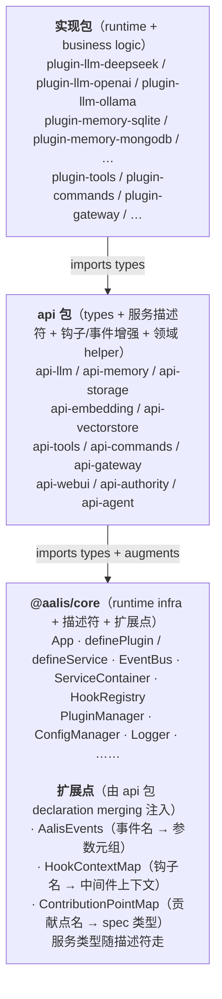

# Aalis 类型分层与 api 包架构

> 本文档描述 Aalis 框架的类型分层原则、api 包契约与扩展点机制。
> 与 [architecture.md](../architecture.md) 互补：架构文档描述运行时数据流，本文档描述编译期类型契约。

## 设计目标

1. **core 业务无关**：`packages/core` 不引用任何 `@aalis/plugin-*` 包，不定义任何业务服务接口（`*Service`）。
2. **接口与实现分离**：每个业务领域（LLM / Memory / Storage / …）由两类包组成：
   - **api 包**（`@aalis/api-*`）：类型、服务描述符（值导出）与扩展点声明
   - **实现包**（`@aalis/plugin-*` 或多个具体实现）：依赖对应 api 包，提供运行时
3. **单向依赖**：`实现包 → api 包 → core`，永不反向。多实现可共存。
4. **扩展点显式化**：core 保留 `AalisEvents` / `HookContextMap` / `ContributionPointMap` 三张表，业务键由 api 包通过 declaration merging 注入。服务类型随描述符走，没有服务名类型表。领域能力（LLM 工具调用/视觉、storage 本地路径权限等）不是 core 扩展点——它们是服务实例 / model handle 上的元数据，由各领域 `*-api` 的 helper 函数（如 `resolveLLMModel`）过滤，不进内核 DI。

## 包分层



## core 提供的扩展点

### 1. 服务描述符 — 类型与绑定随契约包走

api 包导出运行时描述符（值导入）。`defineService<Provider>(name)` 得到普通 `ServiceRef`；需要登记门面时给 `bind`，用 `BindingPort.registrar` / `follow` / `track`。

```ts
// api-llm/src/index.ts
export const llm = defineService<LLMModel>('llm');
```

之后消费方 `uses: { llm }`，`apply` 里 `llm.current` 推断为 `LLMModel | undefined`。动态按名查询（`services.get('llm')`）没有类型可依凭，由调用方收窄。

> **能力不在这里。** `current` / `all` / `services.get` 只按服务名解析，**没有** capabilities 参数；同名多实现的胜者按「偏好 > 优先级 > 注册顺序」解析（`services.prefer` / WebUI 的 Services 页）。领域能力（LLM 的 `tool_calling` / `vision`、storage 的 `local-path` 等）是服务实例 / model handle 上的**元数据**（如 `LLMModel.capabilities`），由各领域 `*-api` 的 helper 函数过滤——见下方「领域能力」。

### 2. `AalisEvents` — 事件名 → 参数元组

```ts
declare module '@aalis/core' {
  interface AalisEvents {
    'scheduler:tick': [jobId: string];
  }
}
```

### 3. `HookContextMap` — 钩子名 → 中间件上下文数据

```ts
// api-agent 注入 agent:* 钩子
declare module '@aalis/core' {
  interface HookContextMap {
    'agent:input:before': { message: IncomingMessage; metadata: Record<string, unknown> };
    'agent:llm:before':   { messages: Message[]; tools: ToolDefinition[]; sessionId: string };
    // ...
  }
}
```

任何在 `hooks.middleware('agent:llm:before', ...)` 处签名的消费插件，都需要 **side-effect import**（或常规 import）该 api 包以激活类型增强。

## 领域能力 = handle 元数据（非 core 扩展点）

领域能力是服务实例 / model handle 上的元数据，不是 core 扩展点：

- 每个 api 包仍定义自己的能力枚举（如 `api-llm` 的 `LLMCapability` = `chat | tool_calling | vision | thinking | audio | …`、`api-storage` 的 `StorageCapability`），但**不**把它声明进任何 core 接口。
- 能力是**服务实例 / model handle 上的元数据**：provider 在 `provide(llm, modelHandle, …)` 时，`modelHandle.capabilities` 诚实反映该 model 能干啥；storage 后端按 root 的 `readable/writable/deletable` 权限位 + `resolveLocalPath`/`watch` 方法存在性体现能力。
- 按能力筛选由各领域 `*-api` 的 **helper 函数**完成，读 `instance.capabilities`，与 core DI 无关：

```ts
import { llm, resolveLLMModel } from '@aalis/api-llm';
// apply({ llm }) 之后：
const entry = resolveLLMModel(llm, ref, ['vision']);
await entry?.instance.chat({ messages });

import { storage, resolveStorageByPath } from '@aalis/api-storage';
const target = resolveStorageByPath(storage, 'data:/foo', ['local-path']);
```

`provide` 的 options 是 `{ priority?, label?, entryId?, onBehalfOf? }`，没有 `capabilities`；`ServiceRef` 与 `services.get` 只按名字解析。能力字符串也会随 entry 上送前端（`ModelInfo.capabilities`）供下拉展示与过滤——同样是元数据用途，不是 DI 通道。

## 当前 api 包索引

| api 包 | 注入到 `HookContextMap` | 描述符（服务名） | 注入到 `ContributionPointMap` | 主要服务接口 |
|---|---|---|---|---|
| `api-llm` | — | `llm` | — | `LLMModel`, `ChatModelRequest`, `ChatResponse`, `ChatStreamChunk`, `ModelInfo`；导出 `resolveLLMModel` / `listLLMModels` helper（吃 `ServiceRef`，按能力过滤）；向 schema-config 注入 `'llm-ref'` 字段类型 |
| `schema-config` | — | — | — | 配置表单词汇：`ConfigSchema` / `SchemaField` / `SchemaGroup` / `SchemaArray` + `SchemaFieldTypes` 扩展点、`CORE_CONFIG_SCHEMA`（零依赖纯类型包；经 declaration merging 把 `configSchema` 挂到 `PluginMeta`） |
| `api-memory` | `memory:clear` | `memory` | — | `MemoryService` |
| `api-storage` | — | `storage` | — | `StorageService`；导出 `resolveStorageByPath` / `createStorageGateway` helper（吃 `ServiceRef`） |
| `api-embedding` | — | `embedding` | — | `EmbeddingService` |
| `api-vectorstore` | — | `vectorstore` | — | `VectorStoreService` |
| `api-tools` | — | `tools` | — | `ToolService`；绑定门面含 `register` / `registerGroup`，另导出 `withToolGroups` |
| `api-commands` | — | `commands` | — | `CommandService` |
| `api-gateway` | `inbound:confirm` / `inbound:command` / `inbound:flow` / `inbound:trigger` / `inbound:dispatch` / `outbound:dispatch` | `gateway` | — | `GatewayService`, `InboundPhaseData`；注入事件 `gateway:phase:done` |
| `api-webui` | — | `webui-server` / `webui-client` | — | `WebUIService`, `WebuiPage`, `WebuiComponent` 等；绑定门面 `registerPage` / `registerAction`；向 `PluginMeta` 注入 `extends`，向 schema-config 注入 SchemaField 表单交互属性 |
| `api-authority` | — | `authority` | — | `AuthorityService`, `ExecutionGuard`, `ExecutionGuardContext`, `CapabilityVisibility`, `AccessConfirmHandler`, `TemporaryGrant` 等 |
| `api-agent` | `agent:input:before` / `agent:turn:after` / `agent:tool:before` / `agent:tool:after` / `agent:reply:before` / `agent:llm:before` / `agent:llm:after` | `agent` | `agent:prompt` | `AgentService`, `PreprocessorFn`, `PluginGroupInfo` |

## 何时需要新建 api 包

满足任一条件即应建立 api 包：

- 该领域有 **>1 个潜在实现**（多 LLM provider、多 memory backend）
- 该领域要 **导出服务描述符**或 **augment** core 的 `HookContextMap` / `AalisEvents` / `ContributionPointMap`（或定义自己的能力枚举 + helper）
- 该领域类型被 **>3 个其他插件**直接 import

只有一个实现且无类型外溢的“叶子插件”（如 plugin-todo-list、plugin-image-sender 内部）不需要 api 包。

## 包该多厚：三类判据

契约包放什么、不放什么，按三条可机检的判据分：

| 后缀 | 放什么 | 判据 |
|---|---|---|
| `util-*` | 与 Aalis 领域**无关**的标准算法 | 换个项目也能原样用（cron 表达式解析、JSON 修复、文本规整） |
| `*-api` | 服务契约 | 导出一个 `defineService` 描述符（值） |
| `schema-*` | 数据格式规范 | Aalis 领域词汇但**不声明服务**、不可能有第二实现（`Message` / `ConfigSchema`） |

`api-cron-engine` 是第一条判据的实例：cron 表达式的解析与匹配是 POSIX 标准算法，
曾长在契约包里占产物 95%，抽成 `@aalis/util-cron` 后契约包从 7919B 降到 411B。

## 导出策略：宁可多导出，不要等人来要

**契约包的公开导出不以「仓内有没有消费者」为条件。** 一个能力只要设计上是给第三方用的，
就直接导出，哪怕仓内暂时没人调。

理由是成本方向不对称：

- 「等有人提 issue 再开放」把成本转嫁给第三方（提 issue → 等排期 → 等发版），还给维护者
  添一轮往返；
- 而**导出是非破坏性的、删除才是破坏性的**。先导出、真长期没人用再议，比反过来安全。

推论：**不要拿「零消费者」当清理理由**去删契约包的导出。`api-storage` 的
`getStorageRootConflicts`、`api-platform` 的 `aggregatePlatformConnections`、
`schema-message` 的 `parseAttachmentRefs` 都属此类——仓内零调用，但都是有意提供的能力，
且各有 `docs/api/` 文档在教第三方使用。它们的维护成本近零（纯函数、无状态、类型守着）。

（这与「删死代码」不冲突：**插件与运行时**里的零消费者代码该删，那是实现；契约包的
导出是**接口**，接口的消费者在仓外。）

## 消费约定

### 单纯使用服务（按名解析，无能力参数）

```ts
import { llm } from '@aalis/api-llm';

export default definePlugin({
  name: '@scope/plugin-example',
  uses: { llm },
  apply({ llm }) {
    const model = llm.current; // LLMModel | undefined（胜者：偏好 > 优先级 > 注册顺序）
  },
});
```

### 按能力挑选实现（领域 helper，非 core DI）

`ServiceRef` 不接受能力参数；要按能力过滤，调对应 api 包的 helper（读 handle 元数据 `instance.capabilities`）：

```ts
import { llm, resolveLLMModel } from '@aalis/api-llm';
const entry = resolveLLMModel(llm, ref, ['tool_calling']);
await entry?.instance.chat({ messages });
```

### 使用钩子（需要 side-effect 增强）

```ts
import '@aalis/api-agent'; // 激活 agent:* 类型增强
hooks.middleware('agent:llm:before', async (data, next) => {
  data.messages.unshift({ role: 'system', content: '...' });
  await next();
});
```

如果同时 `import type { ChatResponse } from '@aalis/api-llm'`，则 api-llm 的副作用导入也会一并触发，无需额外 side-effect import。

### 注册自己的服务与钩子

导出描述符，并把钩子上下文挂进 `HookContextMap`（能力枚举留在自己 api 包里，不进 core）：

```ts
// my-service-api/src/index.ts
import { defineService, type ServiceRef } from '@aalis/core';

export type MyCapability = 'feature-a' | 'feature-b';

export interface MyService {
  capabilities: readonly MyCapability[];
}

export const myService = defineService<MyService>('my-service');

declare module '@aalis/core' {
  interface HookContextMap {
    'my-service:before': { args: unknown; result?: unknown };
  }
}

export function resolveMyService(source: ServiceRef<MyService>, caps?: MyCapability[]): MyService | undefined {
  return source.all().find(e => (caps ?? []).every(c => e.instance.capabilities.includes(c)))?.instance;
}
```

### 提供一种可登记的能力

工具、命令、页面这类"登记进某个服务、由它派活"的能力，由契约包、枢纽服务、按激活绑定门面组成；范本、与四原语的共同契约及允许的差异见
[枢纽服务](./hub-services.md)。

## CI 校验

Biome 在 CI 上对全仓库执行 lint + format check（informational 模式）以及对变更文件执行 hard check。业务接口是否回流 core 由代码审查 + 类型系统兜底（任何业务字段重新进入 `packages/core` 都会立刻反映在 PR diff 中）。

